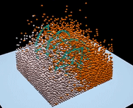

# GeoBlender
A 3D demo of blender in civil/geotechnical/geological engineering refer to [Taichi DEM](https://github.com/taichi-dev/taichi_dem) repo.



## Download & Installation dependency
```bash
$ git clone git@github.com:Linus-Civil/GeoBlender.git
$ cd GeoBlender
$ pip3 install -r requirements.txt
```

## Run
```bash
$ python3 GeoBlender.py
```

## Theory
- The `GeoBlender.py` simulates the movement and interaction of stressed assemblies of rigid {circular in 2D; spherical in 3D} particles using the Distinct-Element Method (DEM)<sup> [1]</sup>.
- Parallel algorithm based on GPU for high performance neighbor search of particles<sup> [2]</sup>.

## To do list
Compared with the original template repo, the contribution of this repo are mainly in two aspects:
- 3D neighbor search of particles 
- Description of complex geometric boundary  based on fixed particles

This is a case built into the commercial discrete element software-PFC. Future improvements will focus on the following aspects to achieve the same results as PFC:
- Implement of contact constitutive model which is more consistent with physics
- Description of complex boundary  based on triangular meshes

## Reference
[1] Cundall, P. A. "A Computer Model for Simulating Progressive Large Scale Movements in Blocky Rock Systems," in Proceedings of the Symposium of the International Society of Rock Mechanics (Nancy, France, 1971), Vol. 1, Paper No. II-8 (1971).
[2] https://zhuanlan.zhihu.com/p/563182093
